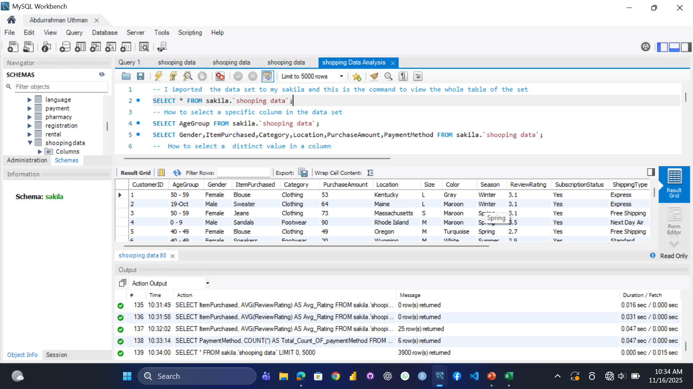
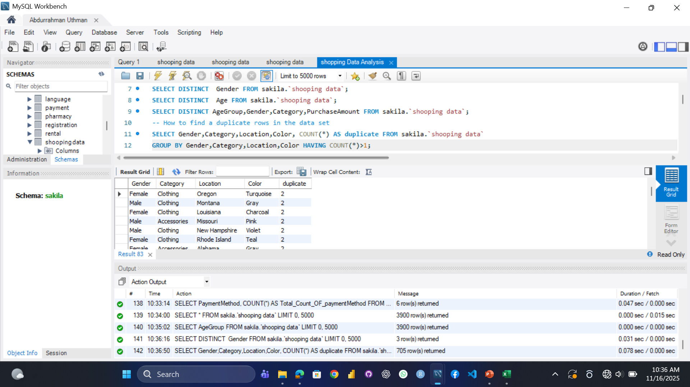
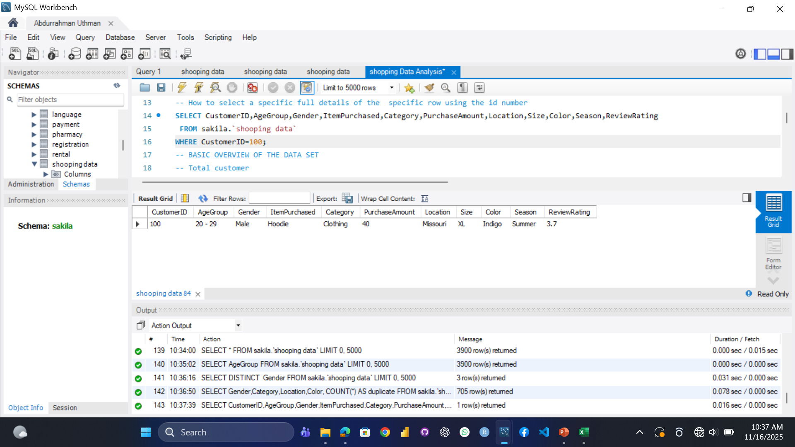
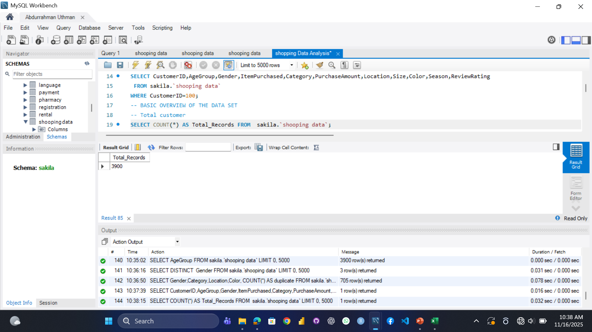
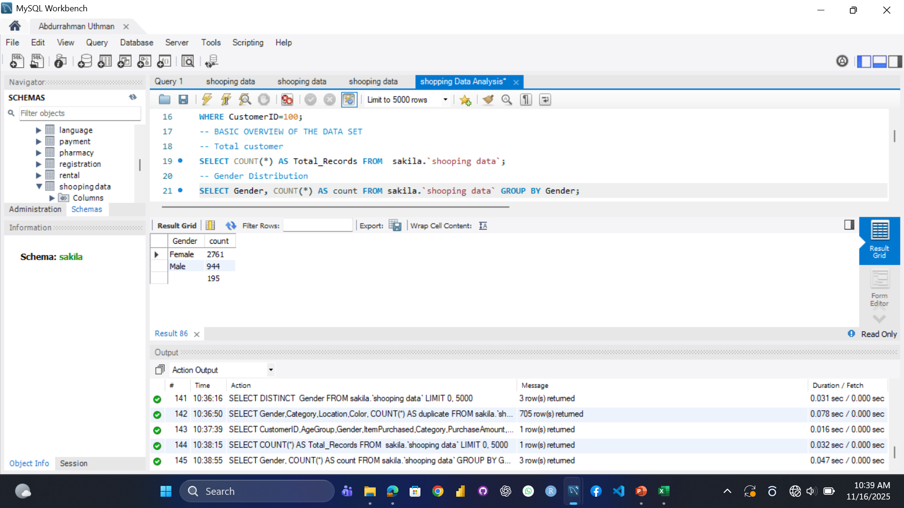
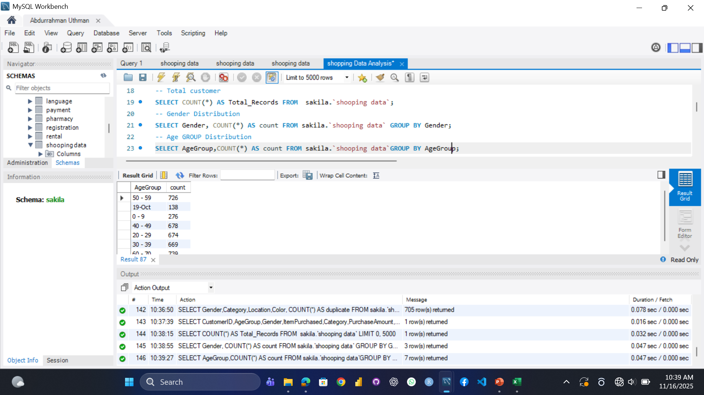

# E-Commerce-Shopping-Data-Analysis
Project Overview

This project is centered on a detailed SQL-based analysis of an e-commerce shopping dataset (referred to as sakila.shooping data).

The primary objective is to extract key business insights related to customer behavior, sales performance, product preferences, and satisfaction metrics. These findings are intended to inform and guide strategic decision-making across various business functions, including marketing, inventory management, and customer service.

The analysis is structured logically across seven domains:

Basic Data Overview & Quality: Checking data integrity and demographic distribution.

Revenue and Purchase Insights: Analyzing total sales, averages, and seasonal/category breakdowns.

Customer Behavior Analysis: Identifying top-spending genders, popular items, and active locations.

Rating and Satisfaction Insights: Assessing product quality via average ratings and identifying low-rated items.

Promotional and Discount Effectiveness: Evaluating the success of promo code usage on average order value (AOV).

Shipping and Payment Preferences: Determining the most popular logistics and transaction methods.

Subscription, Loyalty, and Product Preferences: Measuring the value of the subscription program and analyzing detailed inventory preferences (color, size).

This README is structured to facilitate the documentation of analysis results. For each SQL query listed below, a placeholder is provided where you can insert the corresponding screenshot of the query's output.

1. Data Exploration and Quality Checks

This section covers the initial viewing and quality assessment of the dataset.

Query 1.1: View Entire Table (Reference Only)

Query 1.2: Find Duplicate Rows (Integrity Check)

Query 1.3: Detail for a Specific Customer ID (Quality Check)

2. Basic Data Overview

This section calculates core metrics on the size and distribution of the customer base.

Query 2.1: Total Customer Count

Query 2.2: Gender Distribution

Query 2.3: Age Group Distribution

3. Revenue and Purchase Insights

This section focuses on the total financial performance and purchase value metrics.

Query 3.1: Total Purchase (Total Revenue)

SELECT SUM(PurchaseAmount) AS Total_Purchase FROM sakila.`shooping data`;

$$Insert Screenshot of Query 3.1 Result Here$$

Query 3.2: Total Purchase By Category

SELECT Category,SUM(PurchaseAmount) AS Category_purchase FROM sakila.`shooping data`
GROUP BY Category ORDER BY Category_Purchase;

$$Insert Screenshot of Query 3.2 Result Here$$

Query 3.3: Total Purchase By Gender

SELECT Gender, SUM(PurchaseAmount) AS Total_Purchase_By_Gender FROM sakila.`shooping data`
GROUP BY Gender ORDER BY Total_Purchase_By_Gender;

$$Insert Screenshot of Query 3.3 Result Here$$

Query 3.4: Total Purchase BY Season

SELECT Season, SUM(PurchaseAmount) AS Total_Purchase_By_Season FROM sakila.`shooping data`
GROUP BY Season ORDER BY Total_Purchase_By_Season;

$$Insert Screenshot of Query 3.4 Result Here$$

Query 3.5: Average Purchase Amount (AOV)

SELECT AVG(PurchaseAmount) AS Average_Purchase FROM sakila.`shooping data`;

$$Insert Screenshot of Query 3.5 Result Here$$

Query 3.6: Maximum Purchase

SELECT MAX(PurchaseAmount) AS Maximum_Purchase FROM sakila.`shooping data`;

$$Insert Screenshot of Query 3.6 Result Here$$

Query 3.7: Minimum Purchase

SELECT MIN(PurchaseAmount) AS Minimun_Purchase FROM sakila.`shooping data`;

$$Insert Screenshot of Query 3.7 Result Here$$

4. Customer Behavior Analysis

This section identifies top spenders, popular products, and active markets.

Query 4.1: Cumulative Spend by Gender

SELECT Gender,SUM(PurchaseAmount)AS Total_Spend FROM sakila.`shooping data` GROUP BY Gender;

$$Insert Screenshot of Query 4.1 Result Here$$

Query 4.2: Most Purchased Items (Top 10)

SELECT ItemPurchased, COUNT(*) AS PurchaseCount FROM sakila.`shooping data`
GROUP BY ItemPurchased ORDER BY PurchaseCount  LIMIT 10;

$$Insert Screenshot of Query 4.2 Result Here$$

Query 4.3: Most Active Location

SELECT Location, COUNT(*) AS Total_Purchase FROM sakila.`shooping data` 
GROUP BY Location ORDER BY Total_Purchase DESC;

$$Insert Screenshot of Query 4.3 Result Here$$

5. Rating and Satisfaction Insights

This section measures product satisfaction via average review ratings.

Query 5.1: Average Rating per Category

SELECT Category, AVG(ReviewRating) AS Avg_Rating FROM sakila.`shooping data` 
GROUP BY Category ORDER BY Avg_Rating DESC;

$$Insert Screenshot of Query 5.1 Result Here$$

Query 5.2: Low Rating Items (Customer Dissatisfaction)

SELECT ItemPurchased, AVG(ReviewRating) AS Avg_Rating FROM sakila.`shooping data` 
GROUP BY ItemPurchased  HAVING AVG(ReviewRating) ORDER BY Avg_Rating ;

$$Insert Screenshot of Query 5.2 Result Here$$

6. Promotional and Discount Analysis

This section evaluates the adoption and financial impact of discounts.

Query 6.1: Promo Code Usage Count

SELECT PromoCodeUsed, COUNT(*) AS Usage_count FROM sakila.`shooping data` 
GROUP BY PromoCodeUsed;

$$Insert Screenshot of Query 6.1 Result Here$$

Query 6.2: Average Discount Given

SELECT AVG(DiscountValue) AS Avg_Discount FROM sakila.`shooping data` ;

$$Insert Screenshot of Query 6.2 Result Here$$

Query 6.3: Do Promo Users Spend More (AOV Comparison)

SELECT PromoCodeUsed, AVG(PurchaseAmount) AS Avg_Spend FROM sakila.`shooping data` 
GROUP BY PromoCodeUsed;

$$Insert Screenshot of Query 6.3 Result Here$$

7. Shipping and Payment Preferences

This section analyzes logistical and checkout choices.

Query 7.1: Most Used Shipping Method (Count)

SELECT ShippingType, COUNT(*) AS UsageCount FROM sakila.`shooping data` 
GROUP BY ShippingType ORDER BY UsageCount DESC;

$$Insert Screenshot of Query 7.1 Result Here$$

Query 7.2: Total Spending by Shipping Method

SELECT ShippingType, SUM(PurchaseAmount)AS Total_spend FROM sakila.`shooping data` 
GROUP BY ShippingType ORDER BY Total_spend;

$$Insert Screenshot of Query 7.2 Result Here$$

Query 7.3: Most Popular Payment Method (Count)

SELECT PaymentMethod, COUNT(*) AS Count FROM sakila.`shooping data` GROUP BY PaymentMethod ORDER BY Count DESC;

$$Insert Screenshot of Query 7.3 Result Here$$

Query 7.4: Total Purchase by Payment Method (Revenue)

SELECT PaymentMethod,
SUM(PurchaseAmount) AS Total_Purchase_By_paymentMethod FROM sakila.`shooping data` 
GROUP BY PaymentMethod ORDER BY Total_Purchase_By_paymentMethod;

$$Insert Screenshot of Query 7.4 Result Here$$

8. Loyalty, Subscriptions, and Product Attributes

This final section assesses retention and granular product-level insights.

Query 8.1: Subscription Status Breakdown

SELECT SubscriptionStatus, COUNT(*) AS users FROM sakila.`shooping data` 
GROUP BY SubscriptionStatus;

$$Insert Screenshot of Query 8.1 Result Here$$

Query 8.2: Do Subscribers Spend More (AOV Comparison)

SELECT SubscriptionStatus, AVG(PurchaseAmount) AS Avg_Spend FROM sakila.`shooping data` 
GROUP BY SubscriptionStatus;

$$Insert Screenshot of Query 8.2 Result Here$$

Query 8.3: Average Previous Purchases (Retention Metric)

SELECT AVG(PreviousPurchases) AS Avg_PreviousPurchases FROM sakila.`shooping data` ;

$$Insert Screenshot of Query 8.3 Result Here$$

Query 8.4: Most Popular Color

SELECT Color, COUNT(*) AS Count FROM sakila.`shooping data` GROUP BY Color ORDER BY Count ;

$$Insert Screenshot of Query 8.4 Result Here$$

Query 8.5: Popular Size

SELECT Size, COUNT(*) As Count FROM sakila.`shooping data`  GROUP BY Size ORDER BY Count DESC;

